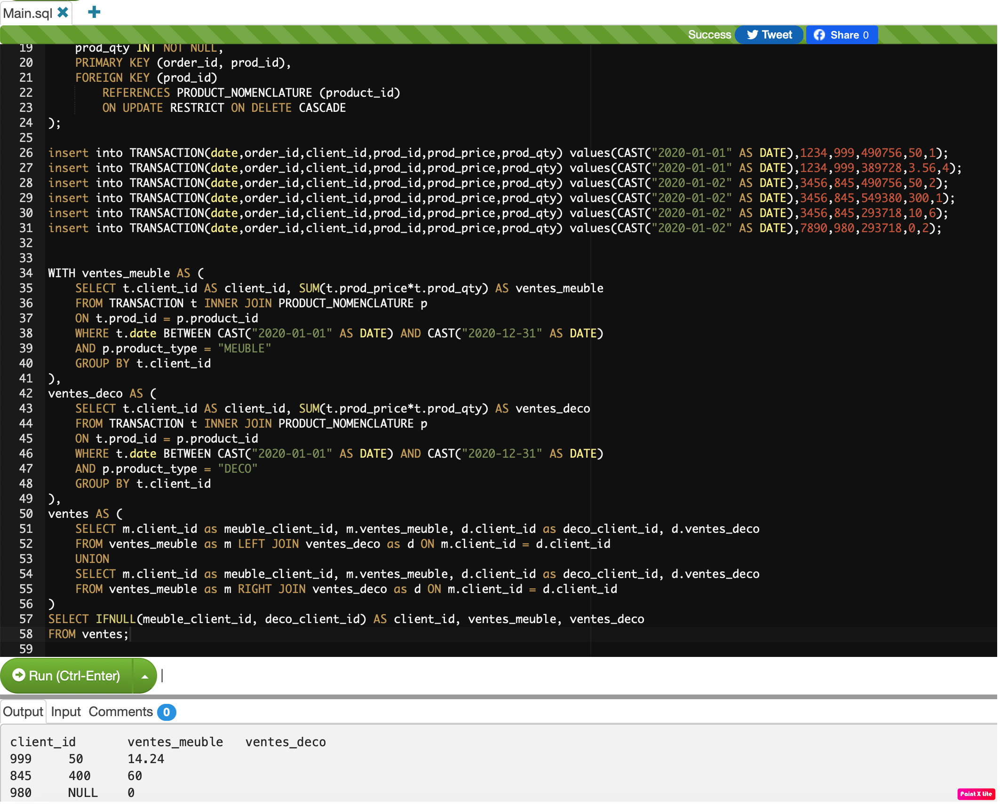

# Objectif : Réaliser des requêtes SQL claires et facilement compréhensibles. 

Afin de faciliter le test, on utilise une solution 100% SQL, et on peut lancer directement le script sur MYSQL Online sans avoir besoin de coder et d’installer l’environnent.

Afin de tester un résultat de « JOIN FULL », on ajoute une ligne de transaction avec un nouveau client qui achète un produit dont le prix est 0 (Cela différent que NULL, par exemple ça peut être une promotion gratuite)

Comment tester via un outil de « MySQL Online »  
 https://paiza.io/projects/r9j0v0GlhkBgVVTRH572og?language=mysql:

-	Copier les sql script (case1.sql, case2.sql) sur l’éditeur indiqué ci-dessus
-	Lance le bouton « Run »
-	Le résultat affiche dans la partie d’output



## Première partie

>********************************************************************************
      SQL WITH MYSQL
>*******************************************************************************
```
SELECT t.date, sum(t.prod_price*t.prod_qty) as ventes
FROM TRANSACTION as t
where t.date BETWEEN CAST("2020-01-01" AS DATE) AND CAST("2020-12-31" AS DATE)
GROUP BY t.date
ORDER BY t.date
```
>********************************************************************************
      RESULT WITH SQL LAUNCH
>********************************************************************************
| date | ventes |
| ------ | ------ | 
| 2020-01-01 | 64.24 |
| 2020-01-02 | 460 |

## Seconde partie
>********************************************************************************
      SQL WITH MYSQL
>*******************************************************************************

```
WITH ventes_meuble AS (
    SELECT t.client_id AS client_id, SUM(t.prod_price*t.prod_qty) AS ventes_meuble
    FROM TRANSACTION t INNER JOIN PRODUCT_NOMENCLATURE p
    ON t.prod_id = p.product_id
	WHERE t.date BETWEEN CAST("2020-01-01" AS DATE) AND CAST("2020-12-31" AS DATE)
	AND p.product_type = "MEUBLE"
    GROUP BY t.client_id
),
ventes_deco AS (
    SELECT t.client_id AS client_id, SUM(t.prod_price*t.prod_qty) AS ventes_deco
    FROM TRANSACTION t INNER JOIN PRODUCT_NOMENCLATURE p
    ON t.prod_id = p.product_id
	WHERE t.date BETWEEN CAST("2020-01-01" AS DATE) AND CAST("2020-12-31" AS DATE)
	AND p.product_type = "DECO"
    GROUP BY t.client_id
),
ventes AS (
    SELECT m.client_id as meuble_client_id, m.ventes_meuble, d.client_id as deco_client_id, d.ventes_deco
    FROM ventes_meuble as m LEFT JOIN ventes_deco as d ON m.client_id = d.client_id
    UNION
    SELECT m.client_id as meuble_client_id, m.ventes_meuble, d.client_id as deco_client_id, d.ventes_deco
    FROM ventes_meuble as m RIGHT JOIN ventes_deco as d ON m.client_id = d.client_id
)
SELECT IFNULL(meuble_client_id, deco_client_id) AS client_id, ventes_meuble, ventes_deco
FROM ventes
```

>********************************************************************************
      RESULT WITH SQL LAUNCH
>********************************************************************************
| date | ventes_meuble | ventes_deco |
| ------ | ------ | ------ |
| 999 | 50 |14.24
| 845 | 400 |60
| 980 | NULL |0

## Préparation des données 
>********************************************************************************
      CREATE MYSQL PRODUCT_NOMENCLATURE TABLE & INSERT DATA
>********************************************************************************
```
CREATE TABLE IF NOT EXISTS PRODUCT_NOMENCLATURE (
    product_id INT  PRIMARY KEY,
    product_type VARCHAR(10) NOT NULL,
    product_name VARCHAR(64) NOT NULL
);
```
>********************************************************************************

| product_id|	product_type|	product_name
| ------ | ------ | ------ |
| 490756|	MEUBLE|	Chaise
| 389728|	DECO|	Boule
| 549380|	MEUBLE|	Canape
| 293718|	DECO|	Mug

- insert into PRODUCT_NOMENCLATURE(product_id,product_type,product_name) values(490756,'MEUBLE', 'Chaise');
- insert into PRODUCT_NOMENCLATURE(product_id,product_type,product_name) values(389728,'DECO', 'Boule');
- insert into PRODUCT_NOMENCLATURE(product_id,product_type,product_name) values(549380,'MEUBLE', 'Canape');
- insert into PRODUCT_NOMENCLATURE(product_id,product_type,product_name) values(293718,'DECO', 'Mug');

>********************************************************************************
      CREATE MYSQL TRANSACTION TABLE & INSERT DATA
>********************************************************************************
```
CREATE TABLE IF NOT EXISTS TRANSACTION (
    date DATE NOT NULL,
    order_id INT NOT NULL,
    client_id INT NOT NULL,
    prod_id INT NOT NULL,
    prod_price DOUBLE NOT NULL,
    prod_qty INT NOT NULL,
    PRIMARY KEY (order_id, prod_id),
    FOREIGN KEY (prod_id)
        REFERENCES PRODUCT_NOMENCLATURE (product_id)
        ON UPDATE RESTRICT ON DELETE CASCADE
);
```

>********************************************************************************

| date| order_id| client_id| prod_id| prod_price| prod_qty| 
| ------ | ------ | ------ |------ | ------ | ------ |
|2020-01-01|	1234|	999|	490756|	50|	1
|2020-01-01|	1234|	999|	389728|	3.56|	4
|2020-01-02|	3456|	845|	490756|	50|	2
|2020-01-02|	3456|	845|	549380|	300|	1
|2020-01-02|	3456|	845|	293718|	10|	6
|2020-01-02|	7890|	980|	293718|	0|	2


- insert into TRANSACTION(date,order_id,client_id,prod_id,prod_price,prod_qty) values(CAST("2020-01-01" AS DATE),1234,999,490756,50,1);
- insert into TRANSACTION(date,order_id,client_id,prod_id,prod_price,prod_qty) values(CAST("2020-01-01" AS DATE),1234,999,389728,3.56,4);
- insert into TRANSACTION(date,order_id,client_id,prod_id,prod_price,prod_qty) values(CAST("2020-01-02" AS DATE),3456,845,490756,50,2);
- insert into TRANSACTION(date,order_id,client_id,prod_id,prod_price,prod_qty) values(CAST("2020-01-02" AS DATE),3456,845,549380,300,1);
- insert into TRANSACTION(date,order_id,client_id,prod_id,prod_price,prod_qty) values(CAST("2020-01-02" AS DATE),3456,845,293718,10,6);
- insert into TRANSACTION(date,order_id,client_id,prod_id,prod_price,prod_qty) values(CAST("2020-01-02" AS DATE),7890,980,293718,0,2);